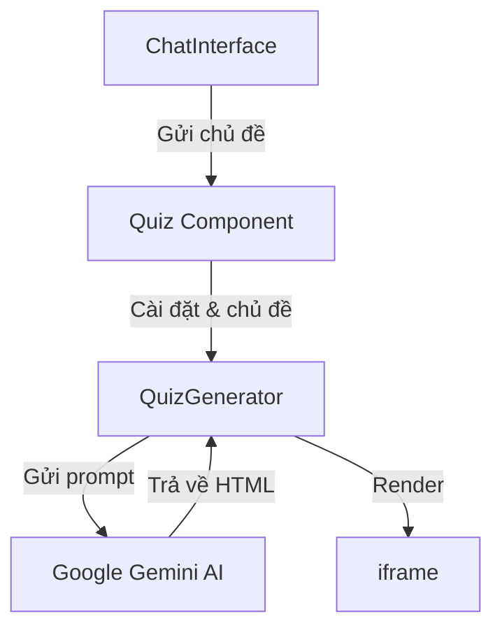

# Hệ Thống Tạo Minigame Tương Tác

## Tổng Quan Kiến Trúc

Hệ thống tạo minigame tương tác bao gồm các thành phần chính sau:



## Chi Tiết Luồng API

### 1. Xử Lý Input (ChatInterface -> Quiz)

```typescript
// ChatInterface gửi topic đến Quiz thông qua callback
const handleSendMessage = () => {
  if (!message.trim()) return;
  
  if (onQuizRequest) {
    onQuizRequest(message.trim()); // Gửi chủ đề đến Quiz
  }
};
```

### 2. Tạo Prompt và Gọi API (QuizGenerator)

```typescript
class AIGameGenerator {
  private genAI: GoogleGenerativeAI;
  private model: any;

  constructor(apiKey: string) {
    this.genAI = new GoogleGenerativeAI(apiKey);
    this.model = this.genAI.getGenerativeModel({ model: "gemini-2.0-flash" });
  }

  async generateMiniGame(topic: string, settings?: GameSettingsData): Promise<MiniGame | null> {
    try {
      // 1. Tạo prompt chi tiết
      const prompt = `Tạo một minigame tương tác về chủ đề "${topic}"...`;
      
      // 2. Gửi yêu cầu đến Gemini
      const result = await this.model.generateContent(prompt);
      const response = await result.response;
      const text = response.text();
      
      // 3. Xử lý phản hồi
      return this.parseMiniGameResponse(text, topic);
    } catch (error) {
      console.error('Lỗi tạo Minigame:', error);
      return null;
    }
  }
}
```

### 3. Xử Lý Response

```typescript
// Hàm xử lý phản hồi từ Gemini
parseMiniGameResponse(rawText: string, topic: string): MiniGame | null {
  let htmlContent = '';
  
  // 1. Tách nội dung HTML từ markdown code block
  const htmlMatch = rawText.match(/```html([\s\S]*?)```/);
  
  if (htmlMatch && htmlMatch[1]) {
    // Lấy nội dung trong code block HTML
    htmlContent = htmlMatch[1].trim();
  } else if (!rawText.includes('```')) {
    // Nếu không có code block, xử lý toàn bộ text
    htmlContent = rawText.trim();
  }
  
  // 2. Tạo đối tượng MiniGame
  return {
    title: `Minigame: ${topic}`,
    description: `Minigame tương tác về chủ đề ${topic}`,
    htmlContent: htmlContent
  };
}
```

## Cấu Trúc Response HTML

Phản hồi từ Gemini được yêu cầu trả về một file HTML hoàn chỉnh với cấu trúc:

```html
<!DOCTYPE html>
<html lang="vi">
<head>
    <meta charset="UTF-8">
    <meta name="viewport" content="width=device-width, initial-scale=1.0">
    <title>Minigame: [Chủ đề]</title>
    <style>
        /* CSS styles */
    </style>
</head>
<body>
    <!-- Game content -->
    <script>
        // Game logic
    </script>
</body>
</html>
```

## Hiển Thị Trong iframe

```typescript
// Component QuizGenerator render game trong iframe
return (
  <iframe
    srcDoc={miniGame.htmlContent}
    title={miniGame.title}
    sandbox="allow-scripts allow-same-origin"
    className="w-full h-full border-none"
  />
);
```

## API Interfaces

```typescript
// 1. Cấu trúc Settings
interface GameSettingsData {
  difficulty: 'easy' | 'medium' | 'hard';
  questionCount: number;
  timePerQuestion: number;
  category: string;
}

// 2. Cấu trúc MiniGame
interface MiniGame {
  title: string;
  description: string;
  htmlContent: string;
}
```

## Xử Lý Response Error

1. **Lỗi Kết Nối API**
   ```typescript
   try {
     const result = await this.model.generateContent(prompt);
   } catch (error) {
     console.error('Lỗi kết nối API:', error);
     return null;
   }
   ```

2. **Lỗi Parse HTML**
   ```typescript
   if (!htmlContent) {
     console.error('Không tìm thấy nội dung HTML hợp lệ');
     return null;
   }
   ```

## Debug Flow

1. Log request:
```typescript
console.log("Đang tạo minigame cho chủ đề:", topic);
console.log("Với các cài đặt:", settings);
```

2. Log response:
```typescript
console.log("Kết quả minigame thô:", text.substring(0, 200) + "...");
```

3. Log parsed content:
```typescript
console.log("HTML đã xử lý:", htmlContent.substring(0, 200) + "...");
```

