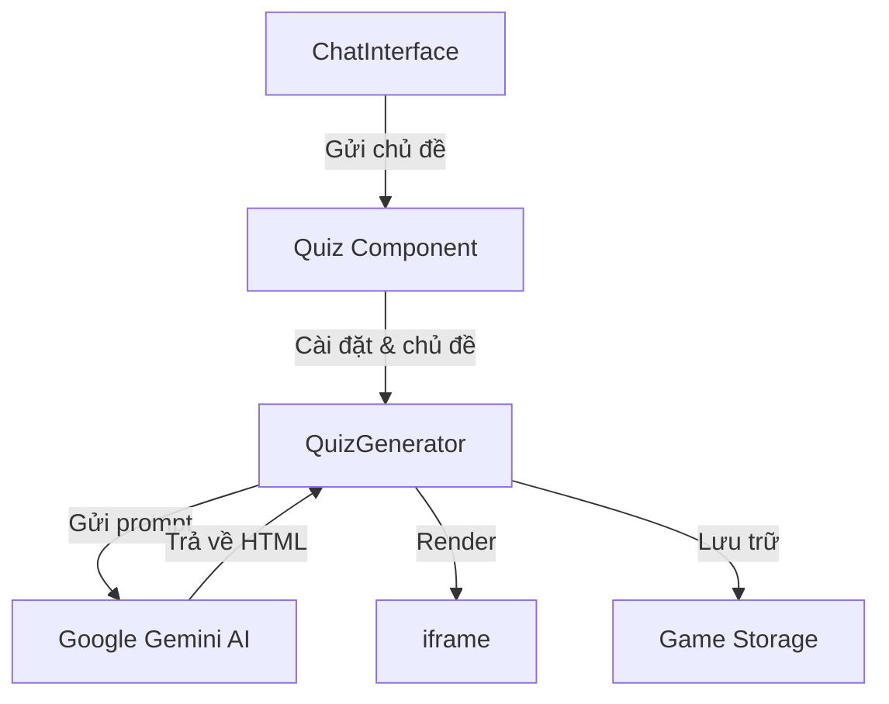

# Hệ Thống Tạo Minigame Tương Tác

## Tổng Quan Kiến Trúc

Hệ thống tạo minigame tương tác bao gồm các thành phần chính sau:



## Chi Tiết Các Component

### 1. ChatInterface (src/components/chat/ChatInterface.tsx)

Component này xử lý việc nhập liệu từ người dùng:

```typescript
// Hàm xử lý gửi tin nhắn
const handleSendMessage = () => {
  if (!message.trim()) return;
  
  // Thêm tin nhắn người dùng vào cuộc hội thoại
  const userMessage = { 
    role: 'user', 
    message: message.trim(), 
    timestamp: new Date() 
  };
  
  // Gửi chủ đề đến Quiz component thông qua callback
  if (onQuizRequest) {
    onQuizRequest(message.trim());
  }
};
```

### 2. Quiz Component (src/pages/Quiz.tsx)

Component chính điều phối toàn bộ luồng tạo minigame:

```typescript
const handleGameRequest = (requestedTopic: string) => {
  if (!requestedTopic.trim()) {
    toast({
      title: "Chủ Đề Trống",
      description: "Vui lòng cung cấp chủ đề cho minigame",
      variant: "destructive",
    });
    return;
  }
  
  setTopic(requestedTopic);
  setShowSettings(true);
};

const handleStartGame = (settings: GameSettingsData) => {
  setGameSettings(settings);
  setShowSettings(false);
  setIsGenerating(true);
  
  // Gọi hàm tạo minigame từ QuizGenerator
  setTimeout(() => {
    if (quizGeneratorRef.current) {
      quizGeneratorRef.current.generateQuiz(topic, settings);
    }
    setIsGenerating(false);
  }, 100);
};
```

### 3. QuizGenerator (src/components/quiz/QuizGenerator.tsx)

Component này xử lý việc tạo minigame thông qua Gemini AI:

```typescript
class AIGameGenerator {
  private genAI: GoogleGenerativeAI;
  private model: any;

  constructor(apiKey: string) {
    this.genAI = new GoogleGenerativeAI(apiKey);
    this.model = this.genAI.getGenerativeModel({ model: "gemini-2.0-flash" });
  }

  async generateMiniGame(userMessage: string, settings?: GameSettingsData): Promise<MiniGame | null> {
    try {
      // Tạo prompt cho Gemini
      const prompt = `Tạo một minigame tương tác đơn giản và vui nhộn về chủ đề "${userMessage}"...`;
      
      // Gửi yêu cầu đến Gemini
      const result = await this.model.generateContent(prompt);
      const response = await result.response;
      const text = response.text();
      
      // Xử lý kết quả
      return this.parseMiniGameResponse(text, userMessage);
    } catch (error) {
      console.error('Lỗi tạo Minigame:', error);
      return null;
    }
  }

  // Xử lý phản hồi từ Gemini
  parseMiniGameResponse(rawText: string, topic: string): MiniGame | null {
    let htmlContent = '';
    const htmlMatch = rawText.match(/```html([\s\S]*?)```/);
    
    if (htmlMatch && htmlMatch[1]) {
      htmlContent = htmlMatch[1].trim();
    } else if (!rawText.includes('```')) {
      htmlContent = rawText.trim();
    }
    
    return {
      title: `Minigame: ${topic}`,
      description: `Minigame tương tác về chủ đề ${topic}`,
      htmlContent: htmlContent
    };
  }
}
```

### 4. Game Storage (src/utils/gameExport.ts)

Module xử lý lưu trữ và chia sẻ minigame:

```typescript
export const saveGameForSharing = (title: string, description: string, htmlContent: string): string => {
  const id = uuidv4();
  const now = Date.now();
  const expiresAt = now + (48 * 60 * 60 * 1000); // 48 giờ
  
  const game: StoredGame = {
    id,
    title,
    description,
    htmlContent,
    createdAt: now,
    expiresAt
  };
  
  // Lưu vào localStorage
  const gamesJson = localStorage.getItem('shared_games');
  let games: StoredGame[] = gamesJson ? JSON.parse(gamesJson) : [];
  games.push(game);
  localStorage.setItem('shared_games', JSON.stringify(games));
  
  return `${getBaseUrl()}/${id}`;
};
```

## Luồng Hoạt Động Chi Tiết

1. **Nhập Chủ Đề**
   - Người dùng nhập chủ đề vào ChatInterface
   - ChatInterface gửi chủ đề đến Quiz component

2. **Cấu Hình Game**
   - Quiz component hiển thị GameSettings
   - Người dùng có thể điều chỉnh:
     - Độ khó (dễ/trung bình/khó)
     - Số câu hỏi
     - Thời gian mỗi câu
     - Thể loại

3. **Tạo Minigame**
   - QuizGenerator nhận chủ đề và cài đặt
   - Tạo prompt chi tiết cho Gemini AI
   - Gửi yêu cầu và nhận phản hồi HTML/CSS/JS

4. **Xử Lý & Hiển Thị**
   - Phân tích phản hồi từ Gemini
   - Tách nội dung HTML từ markdown
   - Render trong iframe an toàn

5. **Chia Sẻ Game**
   - Lưu game vào localStorage
   - Tạo URL chia sẻ (có hạn 48 giờ)
   - Cho phép sao chép link

## Cấu Trúc HTML Game

Mỗi minigame được tạo ra có cấu trúc HTML chuẩn:

```html
<!DOCTYPE html>
<html lang="vi">
<head>
    <meta charset="UTF-8">
    <meta name="viewport" content="width=device-width, initial-scale=1.0">
    <title>Minigame: [Chủ đề]</title>
    <style>
        /* CSS styles */
    </style>
</head>
<body>
    <!-- Game content -->
    <script>
        // Game logic
    </script>
</body>
</html>
```

## Bảo Mật & An Toàn

1. **Sandbox iframe**
   - Minigame chạy trong iframe với sandbox="allow-scripts allow-same-origin"
   - Ngăn chặn truy cập vào DOM chính của ứng dụng

2. **Kiểm Tra Nội Dung**
   - Xác thực HTML trước khi render
   - Lọc các script độc hại

3. **Quản Lý Bộ Nhớ**
   - Tự động xóa game hết hạn
   - Giới hạn dung lượng lưu trữ

## API References

### 1. Game Settings Interface

```typescript
interface GameSettingsData {
  difficulty: 'easy' | 'medium' | 'hard';
  questionCount: number;
  timePerQuestion: number;
  category: string;
}
```

### 2. MiniGame Interface

```typescript
interface MiniGame {
  title: string;
  description: string;
  htmlContent: string;
}
```

### 3. StoredGame Interface

```typescript
interface StoredGame {
  id: string;
  title: string;
  description: string;
  htmlContent: string;
  createdAt: number;
  expiresAt: number;
}
```

## Xử Lý Lỗi

Hệ thống có các cơ chế xử lý lỗi:

1. **Lỗi Tạo Game**
   - Hiển thị thông báo lỗi
   - Cho phép thử lại

2. **Lỗi Render**
   - Fallback UI khi iframe không load được
   - Thông báo lỗi rõ ràng

3. **Lỗi Lưu Trữ**
   - Xử lý khi localStorage đầy
   - Xóa data cũ nếu cần

## Tối Ưu Hiệu Năng

1. **Lazy Loading**
   - GameSettings load khi cần
   - iframe render sau khi có content

2. **Debouncing**
   - Chờ user ngừng nhập
   - Tránh gọi API liên tục

3. **Caching**
   - Lưu games đã tạo
   - Tái sử dụng khi có thể

